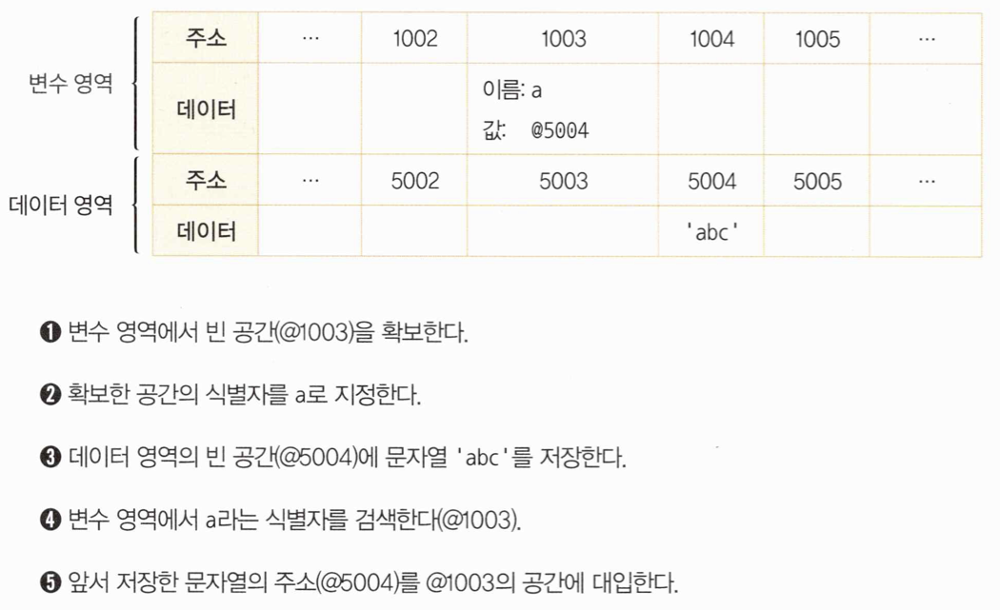
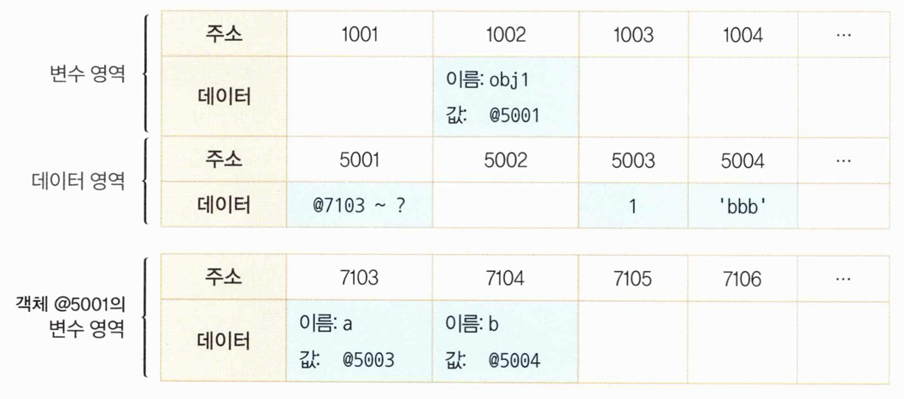
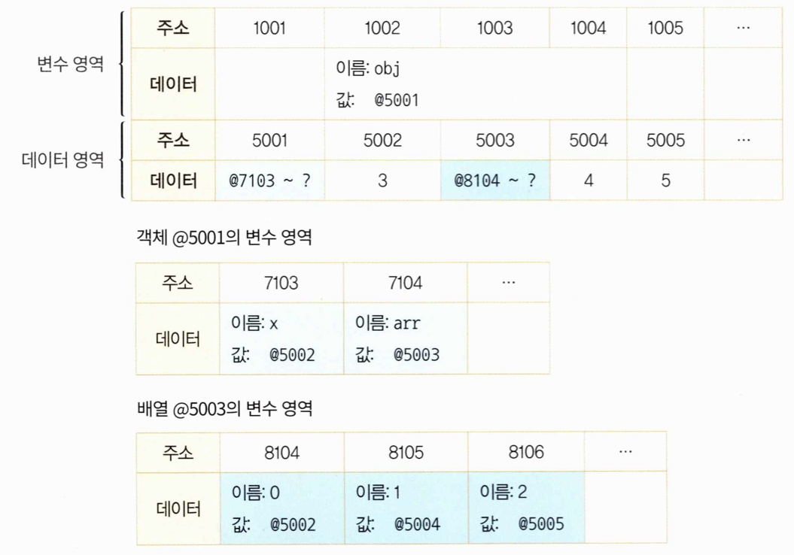

두가지 데이터 타입이 존재

1. 원시형
    
    Number, Boolean, String, null, undefined, Symbol
    
2. 참조형
    
    Object, Array, Function, Date, RegExp, Map, WeakMap, Set, WeakSet
    

기본형은 값이 담긴 주솟값을 복제하는 반면 참조형은 값이 담긴 주솟값들로 이루어진 묶음을 가리키는 주솟값을 복제한다.

기본형은 **불변성**을 띈다.

---

자바스크립트는 변수 선언 시 메모리 공간을 넉넉하게 할당한다. 숫자의 경우 구분하지 않고 64비트 즉 8바이트를 확보한다.

모든 데이터는 바이트 단위의 식별자, **메모리 주솟값**을 통해 서로 구분하고 연결할 수 있다.

변수: 변할 수 있는 무언가. **데이터**

식별자: 어떤 데이터를 식별하는 데 사용하는 이름. **변수명**

---

```jsx
var a;
```

변할 수 있는 데이터를 만든다. 이 데이터의 식별자는 a로 한다.

**변수란 변경 가능한 데이터가 담길 수 있는 공간 또는 그릇**

변수 선언 시 데이터를 저장하기 위한 별도의 메모리 공간을 확보해서 값을 저장하고, 그 주소를 변수 영역에 저장하는 식으로 이뤄진다. 



데이터 영역과 변수 영역을 구분하는 이유는 데이터 변환을 자유롭게 할 수 있게 함과 동시에 메모리를 효율적으로 관리하기 위함. 

예를 들어 문자열 "abc"에 "def"를 추가하거나 "c"를 제거하라고 하면 abc가 저장된 공간에 할당하는 대신 문자열을 새로 만들어 별도의 공간에 저장하고 그 주소를 변수 공간에 연결한다.

또다른 예는 500개의 변수에 5를 할당한다 할때 숫자 5를 500개 선언하는 것이 아니라 5를 한번만 저장하고 해당 주소만 입력한다.

---

**변수와 상수를 구분 짓는 변경 가능성의 대상은 변수 영역 메모리**이다. 즉 한번 데이터 할당이 이뤄진 변수 공간에 다른 데이터를 재할당할 수 있는지 여부

불변성 여부를 구분할 때의 변경 가능성의 대상은 데이터 영역 메모리이다.

**기본형 데이터는 모두 불변값**이다. 한 번 만들어진 값은 가비지 컬렉팅을 당하지 않는 한 영원히 변하지 않는다.

var a = 5 를 a = 7로 변경한다 해도 5라는 데이터가 7로 변하는 것이 아니라 새로운 7을 만들거나 기존에 있던 7을 이용하여 a에 저장한다.

**참조형 데이터는 가변값인 경우가 많지만** 설정에 따라 변경 불가능한 경우도 있고 불변값으로 활용하는 방안도 있다.

```jsx
var obj = {
	a: 1,
	b: 'bbb'
};
```



객체의 변수 영역이 따로 존재한다.

중첩된 객체의 경우 

```jsx
var obj = {
	x: 1,
	arr: [1, 2, 3]
};
```



ex1) obj.arr[1] 검색 = @1002 → @5001 → (@7103 ~ ?) → @7104 → @5003 → (@8104 ~ ?) → @8105 → @5004

어떤 데이터에 대해 자신의 주소를 참조하는 변수의 개수를 참조 카운트라 한다.

참조 카운트가 0인 메모리 주소는 **가비지 컬렉터**의 수거 대상이 된다. 가비지 컬렉터는 런타임 환경에 따라 특정 시점이나 메모리 사용량이 포화 상태에 임박할 때마다 자동으로 수거 대상들을 수거한다. 

기본형 데이터와 참조형 데이터의 변수 복사할 때 차이점

```jsx
var a = 10;
b = a;

var obj1 = { c: 10, d: 'ddd' };
var obj2 = obj1;

b = 15;
obj2.c = 20;
```

b와 a는 서로 다른 주소를 바라보게 되나, obj1과 obj2는 같은 객체를 바라보고 있는 상황이다.

이때

```jsx
b = 15;
obj2 = { c: 20, d: 'ddd' };
```

새로운 객체를 할당함으로써 값을 직접 변경하면 obj1과 값이 달라짐.

즉, 참조형 데이터가 가변값이라는 것은 참조형 데이터 자체를 변경할 경우가 아니라 내부의 프로퍼티를 변경할 경우이다.

---

불변 객체

참조형 데이터에서 데이터 자체를 변경하고자 하면 기본형 데이터와 마찬가지로 기존 데이터는 변하지 않는다. 그렇다면 내부 프로퍼티를 변경할 필요가 있을 때마다 매번 새로운 객체를 만들어 재할당하기로 규칙을 정하거나 자동으로 새로운 객체를 만드는 도구를 활용하면 객체도 불변성을 확보할 수 있다. 

얕은 복사와 깊은 복사

얕은 복사는 바로 아래 단계의 값만 복사하는 방법이고, 깊은 복사는 내부의 모든 값들을 하나하나 찾아서 전부 복사하는 방법이다. 

기본형 데이터일 경우에는 그대로 복사하면 되지만 참조형 데이터는 다시 그 내부의 프로퍼티들을 복사해야 한다. 

```jsx
// 깊은 복사 함수
var copyObjectDeep = function(target) {
	var result = {};
	if (typeof(target) === object && target !== null) {
		for (var prop in target) {
			result[prop] = copyObjectDeep(target[prop]);
		}
	} else {
		result = target;
	}
	return result;
}
```

깊은 복사의 또다른 방법은 객체를 JSON 문법으로 표현된 문자열로 전환했다가 JSON 객체로 바꾸는 것이다. 다만 메서드나 숨겨진 프로퍼티인 __proto__ 나 getter/setter 같이 JSON으로 변경할 수 없는 프로퍼티들은 모두 무시한다. 순수한 정보만 다룰 때 활용하기 좋은 방법이다.

```jsx
var copyObjectViaJSON = function(target) {
	return JSON.parse(JSON.stringify(target));
}
```

---

undefined 와 null

undefined의 경우

1. 값을 대입하지 않은 변수, 즉 데이터 영역의 메모리 주소를 지정하지 않은 식별자에 접근할 때
2. 객체 내부의 존재하지 않는 프로퍼티에 접근하려고 할 때
3. return 문이 없거나 호출되지 않는 함수의 실행 결과

```jsx
var a;
console.log(a); // undefined
```

위의 경우에는 a 에 undefined가 할당되는 것이 아니라 아무것도 할당하지 않고 끝나며, 이후 a 변수에 접근하고자 할 때 비로소 undefined를 반환하는 것이다.

직접 undefined를 할당하는 것을 피하고 비어있음을 나타내는 null을 사용하자. typeof(null) 은 object이다.

동등연산자(==) 일치 연산자(===)

동등연산자는 두 값을 비교하고, 일치 연산자는 두 값과 그 유형을 비교한다.

```jsx
undefined == null // true
undefined === null // false
1 == '1' // true
1 === '1' // false
[] == [] // false
1 == true // true
1 === true // false
'' == 0 // true
'' === 0 // false
```