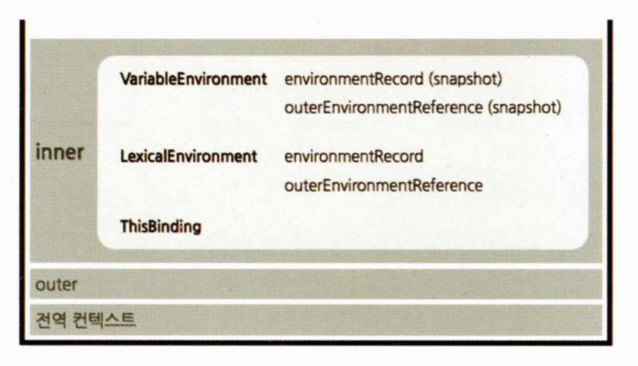

실행 컨텍스트는 **실행할 코드에 제공할 환경 정보들을 모아놓은 객체**로, 자바스크립트의 동적 언어로서의 성격을 가장 잘 파악할 수 있는 개념.

- 동적 언어 - 자료형을 컴파일 시 정하는 것이 아니고 실행 시에 결정한다.

자바스크립트는 어떤 실행컨텍스트가 활성화되는 시점에 선언된 변수를 위로 끌어올리고(호이스팅) 외부 환경 정보를 구성하고 this 값을 설정하는 등의 동작을 수행한다.

동일한 환경에 있는 코드들을 실행할 때 필요한 환경 정보들을 모아 컨텍스트를 구성하고 이를 콜 스택에 쌓아올렸다가 가장 위에 쌓여있는 컨텍스트와 관련 있는 코드들을 실행하는 식으로 전체 코드의 환경과 순서를 보장한다.

동일한 환경, 즉 하나의 실행 컨텍스트를 구성할 수 있는 방법으로 전역공간, eval()함수, **함수** 등이 있다.

자동으로 생성되는 전역공간과 악마로 취급받는 eval을 제외하면 함수를 실행하는 것이 실행 컨텍스트를 구성하는 방법.

- eval 함수 - 문자로 표현된 javascript 코드를 실행하는 함수이다.

기존의 컨텍스트는 새로 쌓인 컨텍스트보다 아래에 위치하게 된다. 어떤 실행 컨텍스트가 활성화될 때 자바스크립트 엔진은 해당 컨텍스트에 관련된 코드들을 실행하는 데 필요한 환경 정보들을 수집해서 실행 컨텍스트 객체에 저장한다. 이 객체는 자바스크립트 엔진이 활용할 목적으로 생성할 뿐 개발자가 코드를 통해서 확인할 수 없다.

- **VariableEnvironment** - 현재 컨텍스트 내의 식별자들에 대한 정보 + 외부 환경 정보. 선언 시점의 LexicalEnvironment의 스냅샷으로 변경 사항은 반영되지 않는다.
- **LexicalEnvironment** - 처음에는 VariableEnvironment와 같지만 변경 사항이 실시간으로 반영된다.
- **ThisBinding** - this 식별자가 바라봐야 할 대상 객체.



---

VariableEnvironment에 담기는 내용은 LexicalEnvironment와 같지만 최초 실행 시의 스냅샷을 유지한다는 점이 다르다. 실행 컨텍스트를 생성할 때 VariableEnvironment에 정보를 먼저 담은 다음, 이를 그대로 복사해서 LexicalEnvironment를 만들고, 이후에는 LexicalEnvironment를 주로 활용하게 된다. 

VariableEnvironment와 LexicalEnvironment의 내부는 **environmentRecord**와 **outerEnvironmentReference**로 구성되어 있다. 

---

LexicalEnvironment 는 컨텍스트를 구성하는 환경 정보들을 사전에서 접하는 느낌으로 모아놓은 것.

**environmentRecord**에는 현재 컨텍스트와 관련된 코드의 식별자 정보(매개변수 식별자, 함수, 변수의 식별자 등)들이 저장된다. 컨텍스트 내부 전체를 처음부터 끝까지 쭉 훑어나가며 **순서대로** 수집한다.

- 전역 실행 컨텍스트는 변수 객체를 생성하는 대신 자바스크립트 구동 환경이 별도로 제공하는 객체, 즉 전역 객체를 활용한다. 전역 객체에는 브라우저의 window, 노드의 global 객체 등이 있다. 이들은 호스트객체

변수 정보를 수집하는 과정을 모두 마쳤더라도 아직 실행 컨텍스트가 관여할 모드들은 실행되기 전의 상태이다. 코드가 실행되기 전임에도 불구하고 자바스크립트 엔진은 이미 해당 환경에 속한 코드의 변수명들을 모두 알고 있게 되는 셈이다. 

즉, '자바스크립트 엔진은 식별자들을 최상단으로 끌어올려놓은 다음 실제 코드를 실행한다'. = **호이스팅** (자바스크립트 엔진이 실제로 끌어올리지는 않지만 편의상 끌어올린 것으로 간주하자)

호이스팅을 할 때 변수명만 끌어올리고 할당 과정은 원래 자리에 그대로 남겨둔다.

```jsx
function a (x) {
	console.log(x);
	var x;
	console.log(x);
	var x = 2;
	console.log(x);
}
a(1);

// hoisting
function a () {
	var x;
	var x;	
	var x;

	x = 1;
	console.log(x);
	console.log(x);
	x = 2;
	console.log(x);
}
a(1);
```

위의 경우 결과 값은 1, 1, 2가 나오게 된다.

변수는 선언부와 할당부를 나누어 선언부만 끌어올리는 반면 **함수 선언은 함수 전체를 끌어올린다.**

```jsx
function a () {
	console.log(b);
	var b = 'bbb';
	console.log(b);
	function b () { ... }
	console.log(b);
}
a();

// hoisting
function a () {
	var b;
	var b = function b () { ... };
	
	console.log(b);
	b = 'bbb';
	console.log(b);
	console.log(b);
}
a();
```

위의 경우 결과 값은 b함수, bbb, bbb 

- 함수 선언문
    
    function 정의부만 존재하고 별도의 할당 명령이 없다.
    
    반드시 함수명이 정의되어 있어야 한다. 
    
- 함수 표현식
    
    정의한 function을 별도의 변수에 할당한다.
    
    함수명이 없어도 된다. 
    

```jsx
// 함수 선언문
function a () { }
a();

// 함수 표현식 (익명 함수 표현식)
var b = function () { } 
b();

// 함수 표현식 (기명 함수 표현식)
var c = function d () { }
c();
d(); // 에러
```

기명 함수 표현식의 경우 d 함수 내부에서는 함수명을 c, d로 사용해도 되지만 외부에서는 c로만 사용가능.

```jsx
console.log(sum(1, 2));
console.log(multiply(3, 4));

function sum (a, b) {
	return a + b;
}

var multiply = function (a, b) {
	return a * b;
}

// hoisting
var sum = function sum (a, b) {
	return a + b;
}
var multiply;

console.log(sum(1, 2));
console.log(multiply(3, 4)); // error: multiply is not a function

multiply = function (a, b) {
	return a * b;
}
```

위 코드의 결과 값은 3, 에러일 것이다.

전역 컨텍스트가 활성화될 때 전역공간에 선언된 함수들이 모두 가장 위로 끌어올려진다. 동일한 변수명에 서로 다른 값을 할당할 경우 나중에 할당한 값이 먼저 할당한 값을 덮어씌운다.

**상대적으로 함수 표현식이 안전하다.**

**스코프**란 식별자에 대한 유효범위이다. 어떤 경계 A의 외부에서 선언한 변수는 A의 외부뿐 아니라 A의 내부에서도 접근이 가능하지만 A의 내부에서 선언한 변수는 오직 A의 내부에서만 접근할 수 있다.

'식별자의 유효범위'를 안에서부터 바깥으로 차례로 검색해나가는 것을 **스코프 체인**이라고 한다. 이를 가능케 하는 것이 LexicalEnvironment의 두 번째 수집 자료인 outerEnvironmentReference이다.

스코프 체인

outerEnvironmentReference는 현재 호출된 함수가 **선언될 당시(과거 시점)**의 LexicalEnvironment를 참조한다. outerEnvironmentReference는  연결리스트 형태를 띈다.

여러 스코프에서 동일한 식별자를 선언한 경우에는 무조건 스코프 체인 상에서 **가장 먼저 발견된 식별자**에만 접근 가능하게 된다.

```jsx
var a = 1;
var b = 2;
var outer = function () {
  var inner = function () {
    console.log(a);
		console.log(b);
    var a = 3;
  };
  inner();
  console.log(a);
};
outer();
console.log(a);
```

위의 결과값은 undefined  2 1 1 이다.

전역 컨텍스트 → outer 컨텍스트 → inner 컨텍스트

코드 안전성을 위해 가급적 전역변수 사용을 최소화한다.