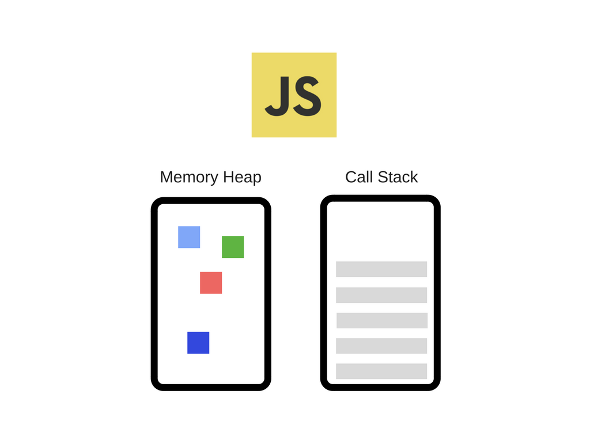
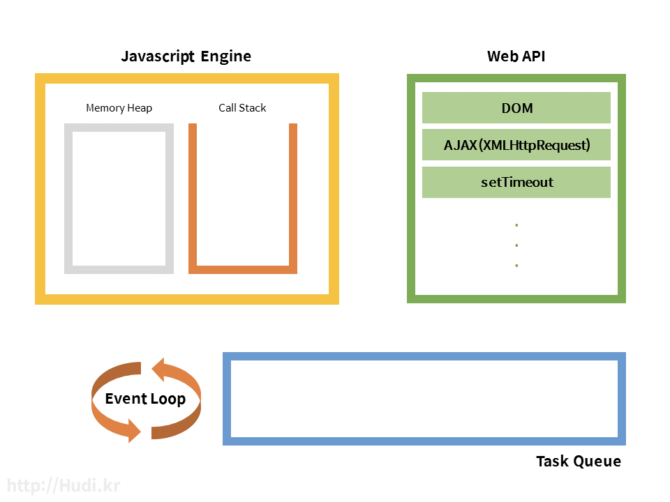
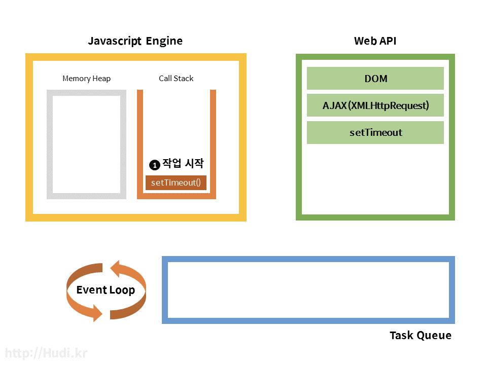
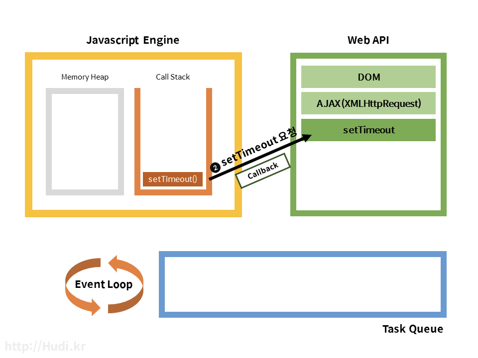
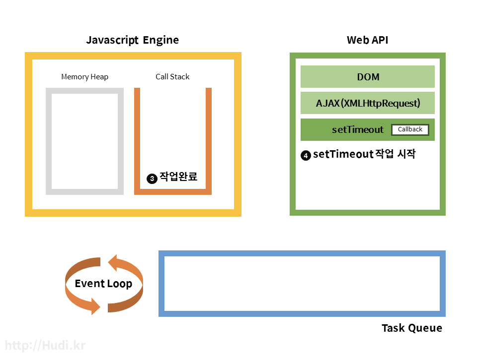
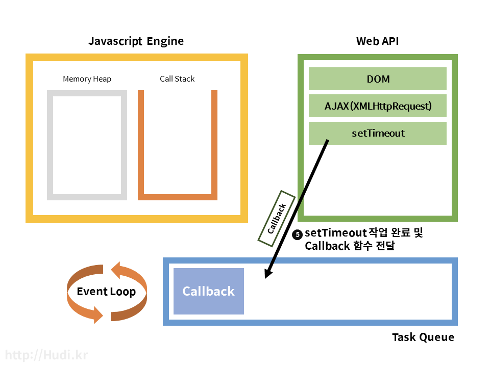
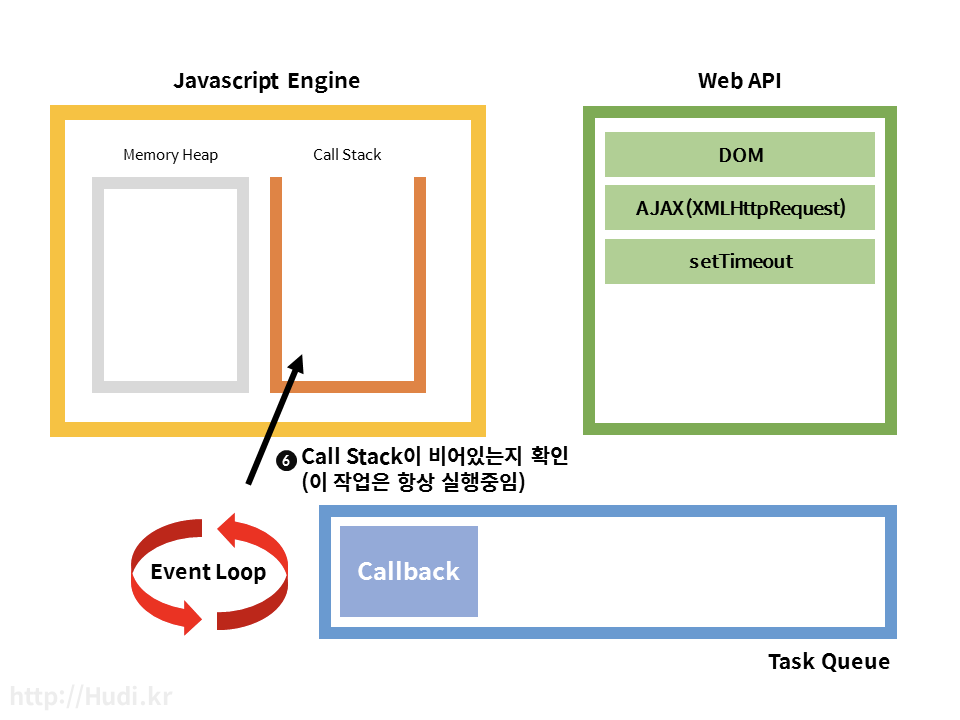
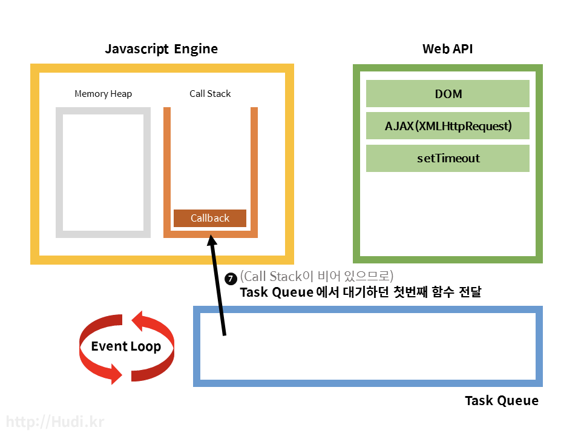
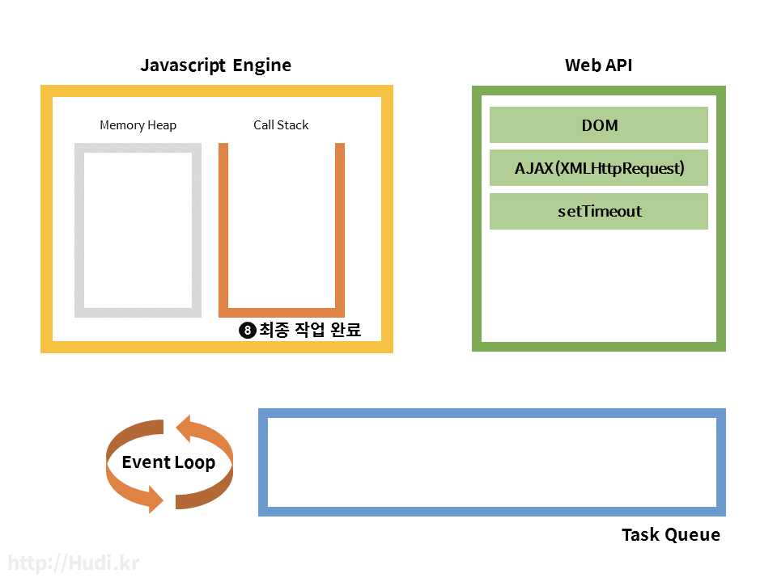

# 브라우저의 Javascript 코드 실행 과정

**자바스크립트 엔진**

자바스크립트 코드를 실행하는 프로그램 또는 [인터프리터](https://www.notion.so/74cdfff7a06648be9f96872294987030) 이다. 자바스크립트 엔진의 대표적인 예는 Google V8 엔진이다. V8은 Chrome과 Node.js에서 사용한다.

엔진의 구조도를 간단히 나타낸 그림이다.



자바스크립트 엔진은 메모리 힙과 단일 호출 스택을 가지고 있다. 하나의 호출 스택만 가지고 있으므로 한번에 단 하나의 함수만 처리될 수 있다. 하지만 자바스크립트는 자바스크립트 엔진으로만 돌아가는 것이 아니다. 

자바스크립트 런타임



사실 자바스크립트 엔진 밖에서도 자바스크립트 실행에 관여하는 요소들이 존재한다. 각각 Web API와 Task Queue, Event Loop 이다. 비동기 작업 시 각 요소의 역할에 대해 알아보자.

**Web API**

Web API는 브라우저에서 제공되는 API이며 AJAX나 Timeout등의 비동기 작업을 실행한다. 자바스크립트에서 setTimeout과 같은 함수를 실행하면 자바스크립트 엔진은 Web API에 setTimeout과 같은 함수를 실행하면 자바스크립트 엔진은 Web API에 setTimeout을 요청하고 동시에 setTimeout에 넣어준 callback까지 전달한다. Call stack 에서는 Web API 요청 이후 setTimeout 작업이 완료되어 제거된다. 

Web API는 방금 요청받은 setTimeout을 완료하고 동시에 전달받은 callback을 task queue라는 곳에 넘겨준다.

**Task Queue (Callback Queue) & Event Loop**

Task queue는 Callback Queue 라고도 하는데 큐 형태로 Web API 에서 넘겨받은 Callback 함수를 저장한다. 이 Callback 함수들은 자바스크립트 엔진의 Call stack의 모든 작업이 완료되면 순서대로 Call Stack에 추가된다. 이 때 Call Stack이 비어있지 않은지(실행중인 작업이 존재하는지)와 Task Queue에 Task가 존재하는지를 판단하고, Task Queue의 작업을 Call stack에 옮기는 일을 Event Loop가 작업한다. Event Loop는 이 작업을 처음부터 끝까지 계속 반복하여 실행한다. 그래서 Event 'Loop'인 것이다.

**호출 스택**

호출 스택은 스택 형태의 저장소로, 자바스크립트 엔진은 함수 호출과 관련된 정보를 이 곳에서 관리한다.

호출 스택에 저장되는 각 항목을 실행 컨텍스트라고 부른다. 

- **실행 컨텍스트**에는 다음 정보들이 저장된다.
    - 함수 내부에서 사용되는 변수
    - 스코프 체인
    - this가 가리키는 객체

```jsx
function add(x, y) {
  return x + y;
}
function add2(x) {
  return add(x, 2);// `add`를 호출
}
function add2AndPrint(x) {
  const result = add2(x);// `add2`를 호출
  console.log(result);// `console.log`를 호출
}
add2AndPrint(3);// `add2AndPrint`를 호출
```

브라우저가 javascript 코드를 실행시킬 때 호출 스택을 다음과 같이 조작한다.

- 스크립트를 불러올 때 전역 실행 컨텍스트를 호출 스택에 추가한다.
- 함수가 호출되면 해당 호출에 대한 실행 컨텍스트를 생성해서 호출 스택에 추가한다.
- 변수에 대입이 일어나면 호출 스택에 저장되어 있는 변수의 내용을 변경한다.
- 함수의 실행이 끝나면 결과값을 반환하고 호출 스택 가장 위에 있는 실행 컨텍스트를 제거 한다.
- 스크립트의 실행이 모두 끝나면 전역 실행 컨텍스트를 호출 스택에서 제거한다.

웹 브라우저는 호출 스택에 실행 컨텍스트가 존재하는 동안 즉 실행 중인 함수가 존재하는 동안에는 먹통이 되어 버린다. 

**작업 큐 (Task Queue)**

어떤 사건(event)이 일어날 때까지 기다리거나 혹은 큰 데이터에 대한 계산이 완료될 때까지 기다리는 데에는 시간이 오래 걸리기 마련이다.

이런 경우 브라우저에서는 다음과 같은 절차를 통해 오래 기다려야 하는 일을 처리할 수 있다.

- 기다려야 하는 일을 **자바스크립트 엔진에서 직접 처리하는 것이 아니라 API를 통해 브라우저에 위임**한다. 이때 일이 끝나면 실행시킬 **콜백을 같이 등록**한다.
- 위임된 일이 끝마녀 그 결과와 콜백을 작업 큐에 추가한다.
- 브라우저는 호출 스택이 비워질 때마다 작업 큐에서 가장 오래된 작업을 꺼내와서 해당 작업에 대한 콜백을 실행시킨다. 브라우저는 이 과정을 끊임없이 반복하는 데 이를 **이벤트 루프**라고 부른다.



1. 코드가 실행되고 setTimeout 함수가 실행되면서 call stack에는 setTimeout 함수가 추가된다.



2. setTimeout 함수는 자바스크립트 엔진이 처리하지 않고 Web API가 처리하기에 setTimeout 에 담긴 Callback 함수를 전달함과 동시에 setTimeout 작업을 요청한다.



3. Call Stack 에서는 모든 작업이 완료되었으므로 setTimeout 작업이 제거된다.
4. Web API는 setTimeout 작업이 실행된다. ms 시간을 기다린다.



5. ms가 지나고 Task Queue로 Callback 함수를 전달한다.



6. Event Loop는 항상 Call Stack이 비어있는지 Task Queue에 작업이 있는지 검사하고 있는데, 마침 지금은 Call Stackdl 비어있고, Task Queue에 수행할 작업이 추가되어 있다.



7. Task Queue에서 대기하던 Callback 함수 하나를 Call Stack으로 보낸다.



8. Callback 함수의 작업도 저부 완료되어 pop되고, 프로그램이 종료된 모습이다.

```jsx
setTimeout(function() {
	console.log("Bye, World!");
}, 0);

console.log("Hello, World!");
```

실행 결과는 "Hello, World!" "Bye, World!" 순서일 것이다. 

1. setTimeout이 실행되고, call stack에 setTimeout이 등록된다. 
2. Web API 에 setTimeout 요청함과 동시에 Call Stack에서는 setTimeout 작업이 제거되고 console.log("Hello, World!"); 작업이 등록된다. 
3. console.log("Hello, World!"); 작업이 완료되고 TaskQueue에서 대기중인 console.log("Bye, World!"); 작업이 Call Stack으로 전달되어 실행되고 프로그램이 종료된다.

- Call Stack, Web API, Task Queue, Event Loop가 어떻게 상호작용 하고 작동하는지 애니메이션으로 보기
    
    [http://latentflip.com/loupe](http://latentflip.com/loupe)